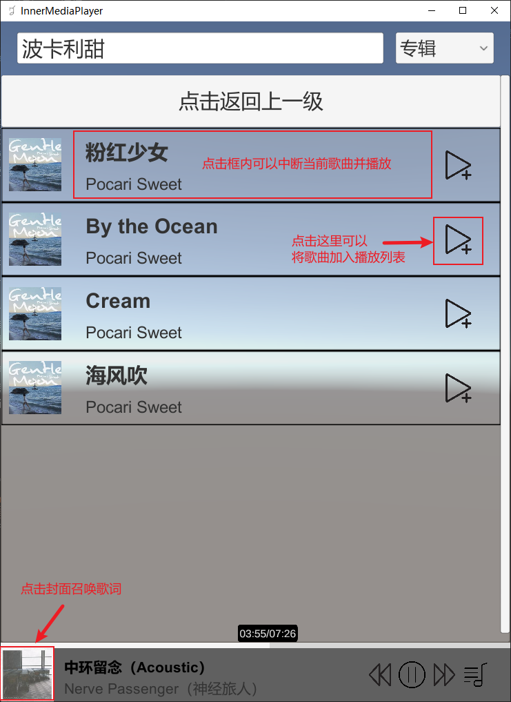
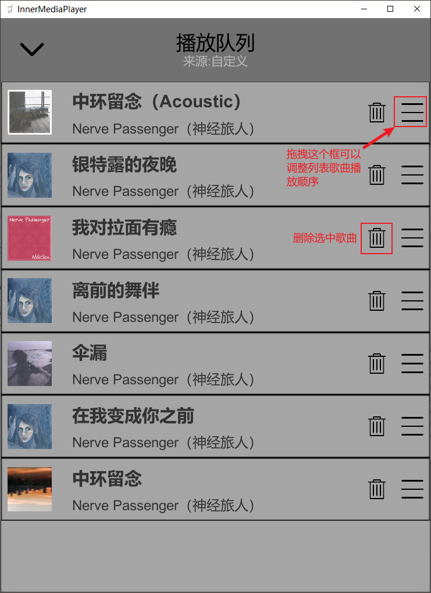
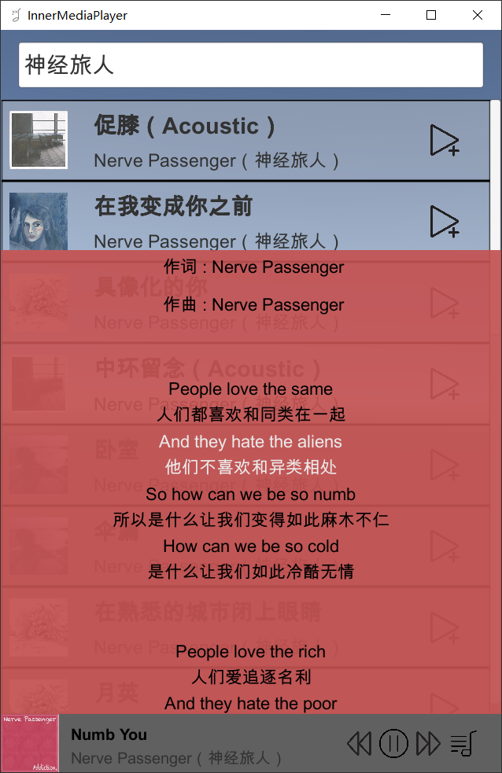
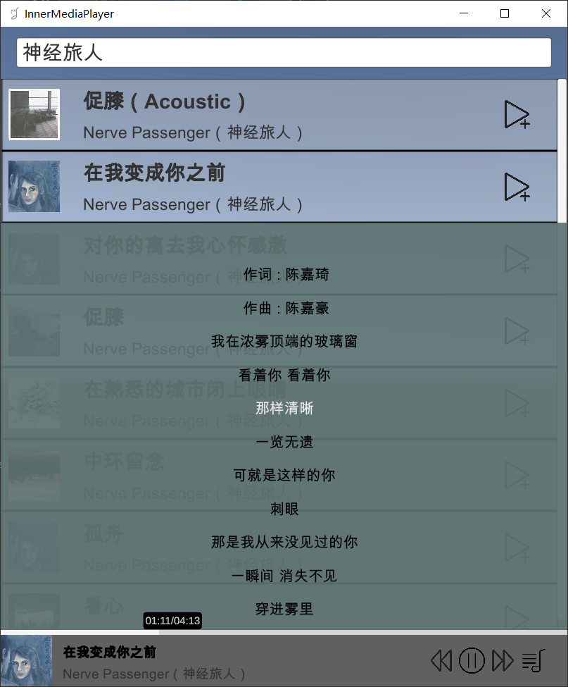
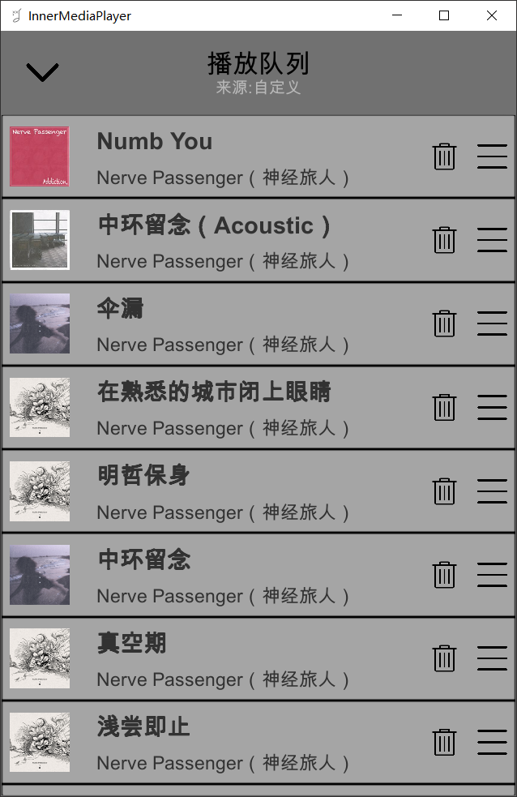

# InnerMediaPlayer

- [概述](#概述)
- [截图](#截图)
- [功能](#功能)

## 概述

**拒绝商业用途** 
&nbsp;&nbsp;&nbsp;&nbsp;&nbsp;&nbsp;&nbsp;基于Unity与网易云WebAPI的播放器，素材来自互联网，可以内嵌入其他Unity项目中，但请一定不要商用！ 
&nbsp;&nbsp;&nbsp;&nbsp;&nbsp;&nbsp;&nbsp;目前只支持使用网易云App扫码登录，登录产生的Cookie会存到persistentPath的Cookie.json中，联网动作只会产生于登录、搜索、播放的操作，账号信息不会泄露。 
&nbsp;&nbsp;&nbsp;&nbsp;&nbsp;&nbsp;&nbsp;注意：不登录只能返回20个搜索结果，非黑胶会员会员歌曲仍然不能播放。以下为软件内部截图。

## 截图

## 功能

- 现有功能
    - 扫码登录账号
    - 歌词显示及滚动
    - 搜索栏
    - 播放列表
    - 播放/暂停/上一曲/下一曲
    - 歌曲播放进度条
- 未来将会添加
    - 专辑包含的内部歌曲、作者名下创作歌曲
    - JSON批量导入歌曲
- 明确不会添加的功能
    - 查看或发表评论
    - 播放MV等视频

---

     
    <body>↑软件图标↑</body>

